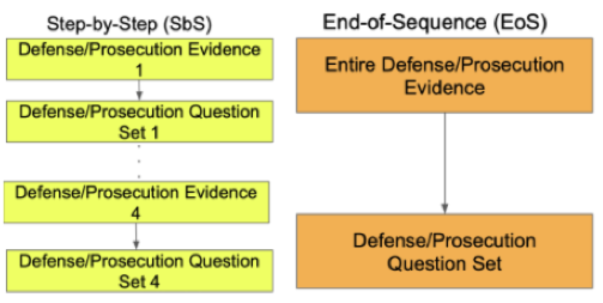

# Query Timing Produces Opposite Positional Biases Between LLMs and Humans

**EMNLP 2026 Findings** · ICBINB @ ICLR 2026 (Entropic Award, Top 3 Paper)

[Paper (arXiv)](https://arxiv.org/abs/2608.12387) | [Jasin Cekinmez](https://jasincekinmez.github.io/)\*, [Addison J. Wu](https://addisonwu05.github.io/)\*, [Thomas L. Griffiths](https://cocosci.princeton.edu/tom/index.php)

\*Equal contribution

In humans, the order evidence is presented in shapes a judgment differently depending on *when* beliefs are queried: people show a recency bias when they update Step-by-Step (SbS) after each piece of evidence, but no overall bias when they judge only at the End-of-Sequence (EoS). Adapting this paradigm to LLMs across three accusatory settings, we find the opposite pattern: most models show no significant order effect under SbS but a strong recency bias under EoS, and within the GPT and Claude families this bias emerges and grows in newer models.



---

## Setup

**1. Clone and install**

```shell
git clone https://github.com/addisonwu05/llm_sbs_eos_positional_bias
cd llm_sbs_eos_positional_bias
pip install -r requirements.txt
```

**2. Add your API keys**

```shell
cp .env.example .env
# then fill in your keys in .env
```

The `.env` file is gitignored — never commit it. The scripts expect these variables:

| Variable | Provider |
|---|---|
| `OpenAI_API_KEY` | OpenAI (also used by `analysis/parse_verdicts.py` to classify verdicts) |
| `Anthropic_API_KEY` | Anthropic |
| `Gemini_API_KEY` | Google Gemini |
| `Together_API_KEY` | Together AI (Llama, Qwen) |

---

## Running Experiments

Each run gives the model a case summary, then all four prosecution (P) and all four defense (D) pieces of evidence in one of two orders — **PD** or **DP** — with the pieces shuffled within each side. It answers likelihood questions along the way (*"If X is GUILTY / NOT GUILTY, how likely is this evidence?"*), then a final P(guilty) and a Guilty / Not guilty verdict.

- **SbS** (`sbs.py`): the likelihood questions follow each individual piece of evidence.
- **EoS** (`eos.py`): the likelihood questions follow all of one side's evidence at once.

All commands are run from the repository root.

**Run all conditions for all models on one case:**

```shell
bash scripts/run_all.sh cases/murder       # EoS + SbS, standard + interleaved, DP + PD
bash scripts/run_compress.sh cases/murder  # SbS-Compressed ablation
```

**Run a single condition manually:**

```shell
python sbs.py --model gpt-4o --case_dir cases/murder                          # SbS, PD
python sbs.py --model gpt-4o --case_dir cases/murder --defend_then_prosecute  # SbS, DP
python eos.py --model gpt-4o --case_dir cases/murder                          # EoS, PD
```

**Key flags:**

| Flag | Description |
|---|---|
| `--defend_then_prosecute` | Defense evidence first (DP); default is prosecution first (PD) |
| `--interleave_verdict` | Also elicit P(guilty) and a verdict after each evidence step (saves `verdict_trail_runN.json`) |
| `--compress` | `sbs.py` only — SbS-Compressed ablation: answers older than two evidence blocks are replaced with just their numeric score |
| `--num_runs <n>` | Runs per condition (default: 30); re-running resumes where it left off |
| `--temperature <t>` | Sampling temperature (default: 1.0) |

Runs are saved to `cases/<case>/<output dir>/<dp|pd>/<model>/` as `transcript_runN.json` (full conversation) and `judgments_runN.json` (every numeric answer, then the final verdict text):

| Condition | Output dir |
|---|---|
| `eos.py` | `outputs_eos` |
| `sbs.py` | `outputs` |
| `sbs.py --compress` | `outputs_compress` |
| `--interleave_verdict` | same, with an `_interleaved` suffix |

---

## Cases

| Folder | Paper setting | Scenario |
|---|---|---|
| `cases/murder` | Criminal | A mother charged with the deaths of her two infant sons (adapted from Qiao & Lagnado) |
| `cases/academic` | Academic misconduct | A PhD student investigated for fabricating or falsifying data |
| `cases/vandalism` | Social misconduct | An employee suspected of breaking the office printer |

Each `case.yaml` holds the case summary, the two verdict questions, and for each side four `evidence_blocks` (evidence plus its SbS questions) and the EoS questions. To add a setting, add a folder with a `case.yaml` in the same format.

---

## Analysis

Run these after the experiments, from the repository root. Figures are written to `figures/`.

```shell
# 1. Classify each free-text verdict as guilty / not guilty (GPT-5.4; needs OpenAI_API_KEY)
python analysis/parse_verdicts.py

# 2. Fisher's exact tests (DP vs PD within each mode) and Breslow-Day (EoS vs SbS)
python analysis/significance.py --case_dir cases/murder --variant main   # or: interleaved, compress

# 3. Guilty-verdict proportions by model, response mode, and order
python analysis/plot_verdicts.py --case_dir cases/murder --models gpt-3.5-turbo gpt-4o gpt-5

# 4. SbS likelihood judgments across evidence stages
python analysis/plot_sbs_trajectory.py --case_dir cases/murder --model gpt-4o --order dp

# 5. Observed vs. Bayes-predicted intermediate P(guilty) (interleaved runs)
python analysis/merge_interleaved.py
python analysis/bayesian_updating.py --case_dir cases/murder
```

---

## Repository Structure

```
requirements.txt             # Python dependencies
.env.example                 # API key name template (copy to .env, which is gitignored)
paper_experiment_figure.png  # Paradigm figure shown above

sbs.py                       # Step-by-Step experiment (+ --compress ablation)
eos.py                       # End-of-Sequence experiment
utils.py                     # Model clients, shared flags, run/resume loop

cases/                       # One folder per accusatory setting
  murder/case.yaml           # Criminal
  academic/case.yaml         # Academic misconduct
  vandalism/case.yaml        # Social misconduct

scripts/
  run_all.sh                 # All models × {EoS, SbS} × {DP, PD} × {standard, interleaved}
  run_compress.sh            # SbS-Compressed ablation for all models

analysis/
  common.py                  # Loads outputs; model display names
  parse_verdicts.py          # LLM-classifies free-text verdicts as guilty / not guilty
  significance.py            # Fisher's exact + Breslow-Day tests
  plot_verdicts.py           # Verdict-proportion bar charts
  plot_sbs_trajectory.py     # SbS likelihood judgments by stage
  merge_interleaved.py       # Joins interleaved judgments with their verdict trails
  bayesian_updating.py       # Observed vs. Bayes-predicted P(guilty)
```

---

## Citation

```bibtex
@inproceedings{cekinmez2026querytiming,
    title={Query Timing Produces Opposite Positional Biases Between {LLM}s and Humans},
    author={Jasin Cekinmez and Addison J. Wu and Thomas L. Griffiths},
    booktitle={Findings of the Association for Computational Linguistics: EMNLP 2026},
    year={2026}
}
```

## Questions

Email Jasin (jasincekinmez@princeton.edu) or Addison (addisonwu@princeton.edu)!
